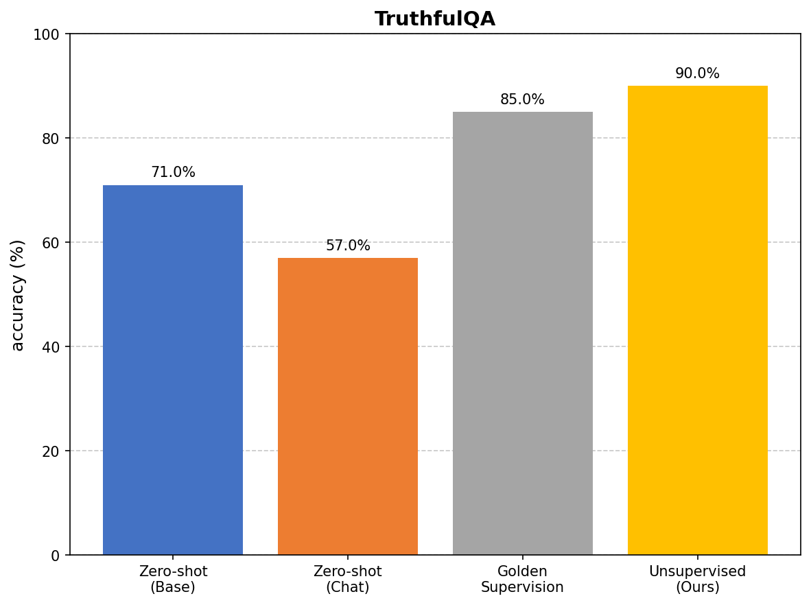

# Internal Coherence Maximization Implementation

Implementation of Algorithm 1 from the paper **"Unsupervised Elicitation of Language Models"** (Wen et al., 2025).

 **Paper**: [arXiv:2506.10139](https://arxiv.org/abs/2506.10139)

---

##  Overview

ICM is an unsupervised algorithm that enables language models to generate their own training labels without external supervision. It works by finding labels that are:
- **Mutually Predictable**: Each label can be inferred from all other labels
- **Logically Consistent**: No contradictory labels (e.g., two conflicting answers both marked True)

---

## Results

| Condition | Accuracy |
|-----------|----------|
| Zero-shot (Base) | 71.0% |
| Zero-shot (Chat) | 57.0% |
| Golden Supervision | 85.0% |
| **Unsupervised (ICM)** | **90.0%** |




---

##  Algorithm

```
1. Initialize D with K=8 randomly labeled examples
2. For N=256 iterations:
   a. Update temperature T (simulated annealing)
   b. Sample an example
   c. Ask model: "What label fits best given current D?"
   d. Compute Δ = U(D_new) - U(D_old)
   e. If Δ > 0: Accept
      Else: Accept with probability 
```

**Scoring Function**: `U(D) = α × P(D) - I(D)`
- `P(D)` = Mutual predictability
- `I(D)` = Inconsistency count
- `α = 50`

---

##  Models Used

| Model | Endpoint | Purpose |
|-------|----------|---------|
| `meta-llama/Meta-Llama-3.1-405B` | `/v1/completions` | Base model |
| `meta-llama/Meta-Llama-3.1-405B-Instruct` | `/v1/chat/completions` | Chat model |

---

##  Hyperparameters

| Parameter | Value | Description |
|-----------|-------|-------------|
| K | 8 | Initial random examples |
| N | 256 | Number of iterations |
| α | 50 | Predictability weight |
| T₀ | 10 | Initial temperature |
| T_min | 0.01 | Final temperature |
| β | 0.99 | Cooling rate |


---

##  References

- Wen, J., et al. (2025). *Unsupervised Elicitation of Language Models*. [arXiv:2506.10139](https://arxiv.org/abs/2506.10139)
- Lin, S., et al. (2021). *TruthfulQA*. [arXiv:2109.07958](https://arxiv.org/abs/2109.07958)


